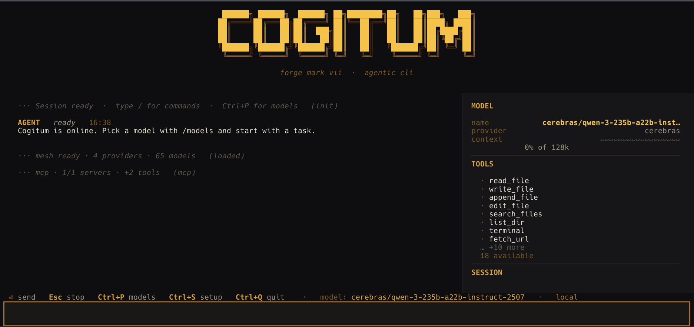
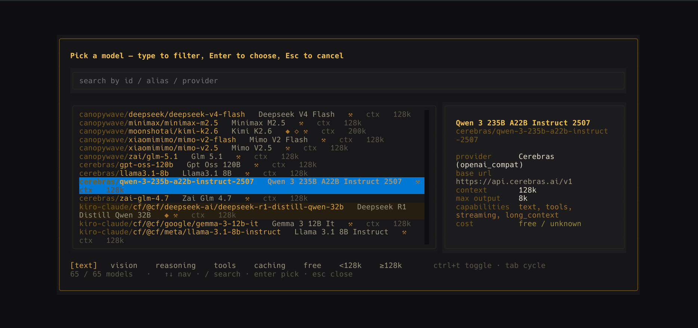
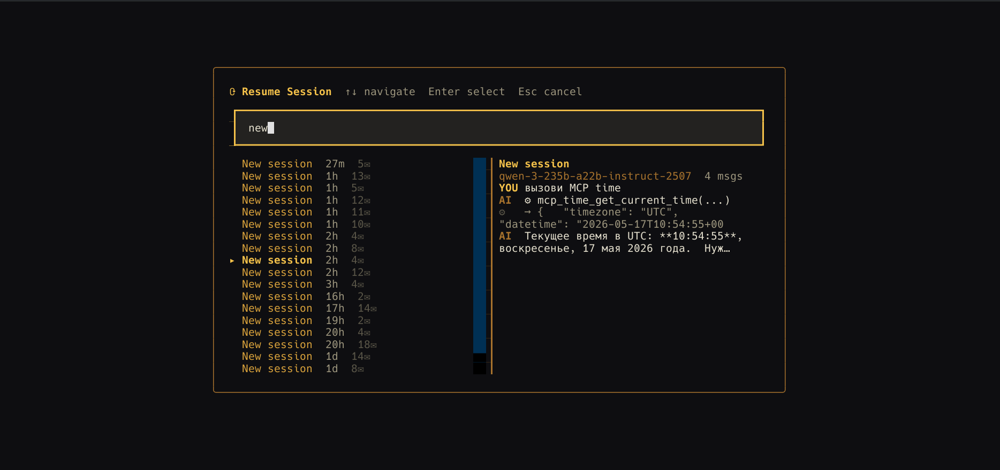
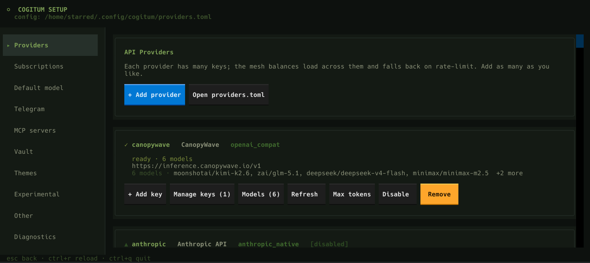
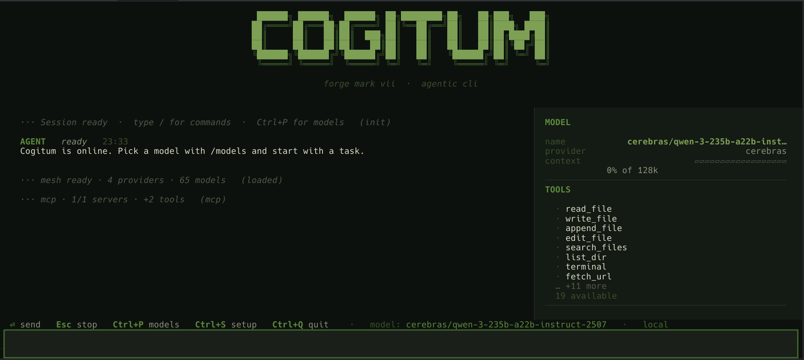
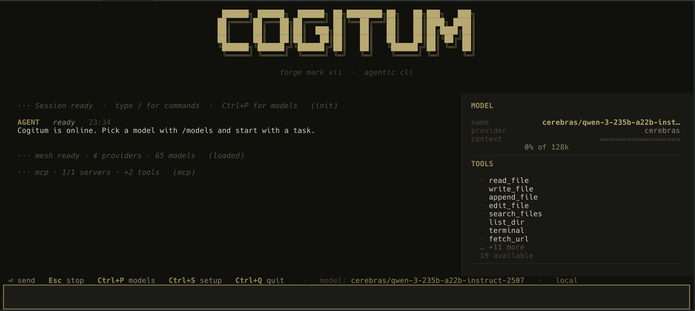
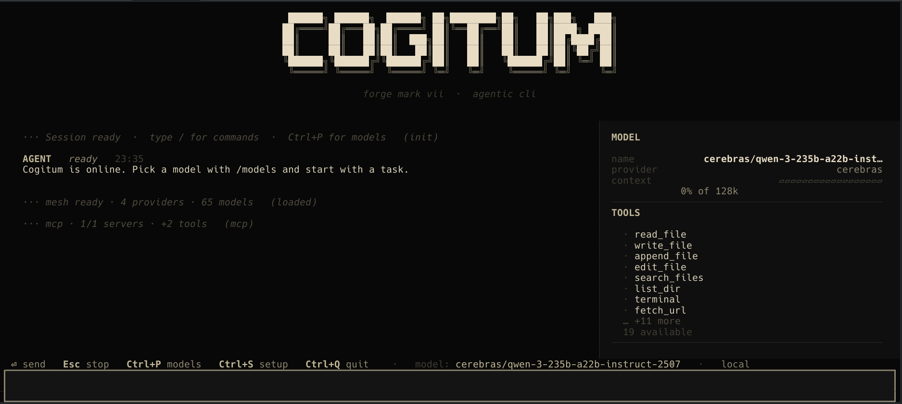
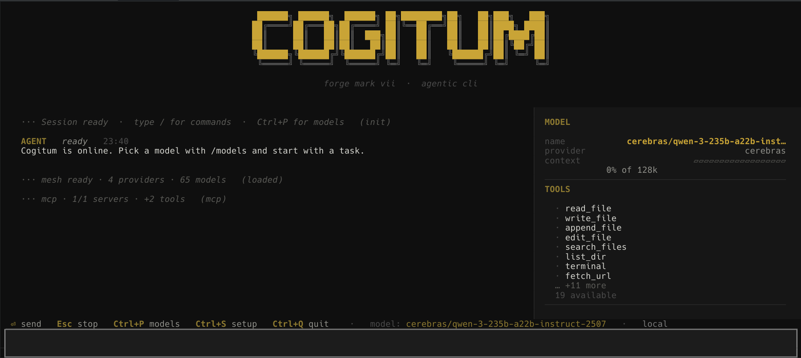
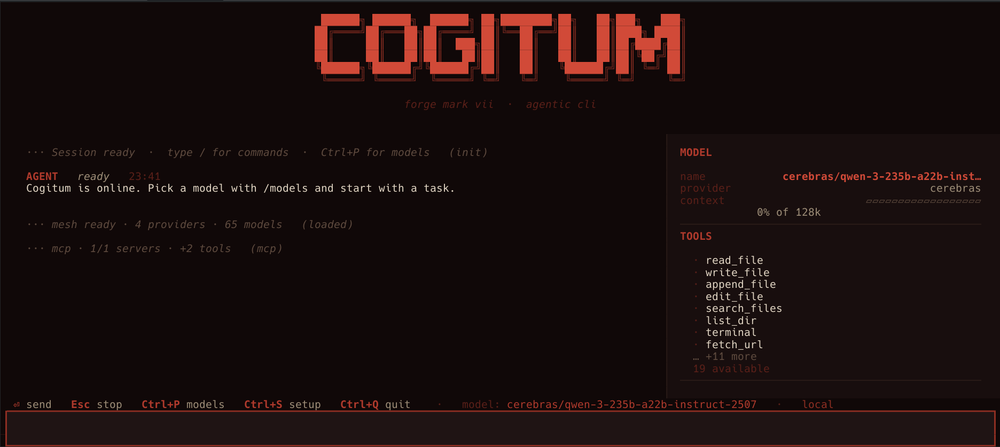

<div align="center">

# ⚔️ COGITUM

**Sovereign agentic CLI — forge, delegate, persist.**

[](https://www.npmjs.com/package/cogitum)
[](https://www.npmjs.com/package/cogitum)
[](https://github.com/StarryCod/cogitum/stargazers)
[](LICENSE)
[](https://python.org)

<a href="https://star-history.com/#StarryCod/cogitum&Date">
  <picture>
    <source media="(prefers-color-scheme: dark)" srcset="https://api.star-history.com/svg?repos=StarryCod/cogitum&type=Date&theme=dark" />
    <source media="(prefers-color-scheme: light)" srcset="https://api.star-history.com/svg?repos=StarryCod/cogitum&type=Date" />
    
  </picture>
</a>

*Imperial Fists colourway. Built for engineers who think in terminals.*

</div>

---

<p align="center">
  
</p>

> **Cogitum** is a terminal-native AI agent with a multi-provider LLM mesh, 17 built-in tools, persistent sessions, memory, 83 bundled skills, checkpoints, and a Telegram gateway — all wrapped in a keyboard-driven TUI that stays out of your way.

---

## ✨ What makes it different

| Feature | Why it matters |
|---------|----------------|
| 🕸️ **Multi-Provider Mesh** | Load-balance across OpenAI, Anthropic, OpenRouter, Cerebras, Groq, CanopyWave, and any OpenAI-compatible endpoint. Automatic failover, key pooling, rate-limit tracking. |
| 🧰 **17 Built-in Tools** | Terminal, browser (Playwright), web search, file read/write/edit, git-style search, memory, skills, checkpoints, delegation, MCP servers. |
| 🛡️ **Approval Layer** | Dangerous operations (`rm`, `git push`, package installs) pause for your approval. Per-tool risk levels. |
| 💾 **Persistent Sessions** | Every conversation is auto-saved as JSONL. Resume anytime with `/resume`. Search across sessions. |
| 🧠 **Memory & Skills** | Cross-session memory + **83 bundled skills** (coding, research, MLOps, red-teaming, smart-home…) injected into every system prompt. |
| 📦 **Cogit Checkpoints** | One-command project snapshots before destructive edits. Restore, diff, garbage-collect. |
| 🎯 **Self-Learning Skills** | The agent observes your workflow and **writes its own skills** via the `skills` tool — refining its expertise for your specific projects over time. |
| ⚔️ **Cogitator Legion** | Recursive 2-level swarm. The lead Cogitum spawns up to 5 parallel Cogitators (L1); each may further dispatch up to 3 sub-Cogitators (L2). Real-time sibling roster, async message bus, click the dispatch card to open a live tree view. Replaces the old single-shot delegation. |
| 📡 **Telegram Gateway** | Run the same agent as a personal Telegram bot with streaming, inline keyboards, and media support. |
| 🔌 **MCP Integration** | Connect external MCP servers (stdio / HTTP) — tools are auto-discovered and registered dynamically. |

---

## 📸 Interface Tour

### Main Chat
<p align="center">
  
</p>

- **Feed** — streaming markdown bubbles, tool cards, thinking blocks, queued messages.
- **Inspector** — live token count, context window usage, model info.
- **Queue Bar** — pending messages while the agent works. Press `↑` on empty composer to edit the last queued item.
- **Composer** — slash commands (`/setup`, `/models`, `/resume`, `/clear`, `/quit`), history with `↑/↓`, paste folding for long content.

### Model Picker — `Ctrl+P` or `/models`
<p align="center">
  
</p>

- Live search across all resolved models (ID, alias, provider, capabilities).
- Fuzzy scoring fallback via `rapidfuzz`.
- Toggle filters: `text`, `vision`, `reasoning`, `tools`, `caching`, `free`, context size.
- Detail pane with cost, key health, and capabilities.

### Session Picker — `/resume`
<p align="center">
  
</p>

- Search across saved sessions.
- Preview pane shows last 8 messages with role badges.
- `↑/↓` navigate, `Enter` resume, `Delete` remove.

### Setup Wizard — `Ctrl+S` or `/setup`
<p align="center">
  
</p>

- Add providers from presets or custom config.
- OAuth / PKCE for Claude Pro/Max and ChatGPT Plus/Pro.
- Four secret backends: `env`, `vault` (AES-256-GCM), `keyring`, `plain`.
- Live connectivity testing before you save.

---

## 🚀 Quick Start

Three install paths. Pick whichever matches your platform / habits.

### npm (recommended — works on Linux, macOS, Windows)

```bash
npm install -g cogitum
cog
```

The npm package is a thin launcher; `npm install -g` just registers the `cog` and `cogitum` commands. The first `cog` invocation bootstraps the Python backend (clones the repo, creates a venv, installs deps) — this happens **once**, then every subsequent launch runs at native Python speed.

| Wrapper command | Effect |
|---|---|
| `cog` | Launch the TUI (auto-bootstraps on first run) |
| `cog setup` | Run the provider wizard |
| `cog --update` | Pull latest from origin/master, reinstall deps |
| `cog --repair` | Wipe and recreate the venv |
| `cog --where` | Print the install directory |
| `cog --version-wrapper` | Print npm-wrapper version + install metadata |

Anything else is forwarded to `python -m cogitum.cli`.

> Do **not** use `sudo npm install -g`. If you hit `EACCES` errors, [fix npm permissions](https://docs.npmjs.com/resolving-eacces-permissions-errors-when-installing-packages-globally) or use a Node version manager (nvm, fnm, volta).

### Linux / macOS — bash one-liner

```bash
curl -fsSL https://raw.githubusercontent.com/StarryCod/cogitum/master/scripts/install.sh | bash
```

Clones to `~/.local/share/cogitum`, builds a venv, installs all extras, writes `cog` / `cogitum` bash shims to `~/.local/bin` (ensure that's on your PATH).

### Windows — PowerShell one-liner

```powershell
iwr https://raw.githubusercontent.com/StarryCod/cogitum/master/scripts/install.ps1 | iex
```

Clones to `%LOCALAPPDATA%\cogitum`, builds a venv, installs all extras, writes `cog.cmd` / `cogitum.cmd` shims to `%LOCALAPPDATA%\Microsoft\WindowsApps` (which is on PATH by default on Windows 10/11).

If you prefer manual install:

```powershell
# 1. Prerequisites — Python 3.11+ and Git on PATH
python --version
git --version

# 2. Clone + install
git clone https://github.com/StarryCod/cogitum.git $env:LOCALAPPDATA\cogitum
cd $env:LOCALAPPDATA\cogitum
python -m venv .venv
.venv\Scripts\pip install -e ".[all]"

# 3. Run
.venv\Scripts\python -m cogitum.cli setup
.venv\Scripts\python -m cogitum.cli
```

### From source (any platform)

```bash
git clone https://github.com/StarryCod/cogitum.git
cd cogitum
pip install -e ".[all]"
cog setup
cog
```

> **Requirements:** Python 3.11+, Git. Optional: Node.js 16+ if installing via npm.

### Key Bindings (TUI)

| Key | Action |
|-----|--------|
| `Enter` | Send message |
| `Shift+Enter` / `Ctrl+Enter` | New line in composer |
| `↑ / ↓` | Browse message history (when cursor at edge) |
| `/` | Open slash-command autocomplete |
| `Esc` | Cancel running agent |
| `Ctrl+P` | Open model picker |
| `Ctrl+S` | Open setup wizard |
| `Ctrl+C` | Copy selection (or "Use Ctrl+Q to quit" hint) |
| `Ctrl+Q` | Quit |

### Slash Commands

| Command | Description |
|---------|-------------|
| `/setup` | Provider & auth wizard |
| `/models` | Browse and switch models |
| `/model <id>` | Direct model switch |
| `/new` | Fresh session |
| `/resume` | Resume past session |
| `/title <name>` | Rename session |
| `/tools` | List available tools |
| `/mcp` | MCP server status |
| `/mcp reload` | Hot-reload MCP config |
| `/godmode <on/off/list>` | Toggle aggressive system prompts |
| `/clear` | Clear feed |
| `/quit` | Exit |

---

## 🧰 Tool Arsenal

### Filesystem
- `read_file` — paginated file reading with line numbers. Blocks sensitive paths.
- `write_file` — auto-cogit before overwrite.
- `edit_file` — exact find-and-replace with context preview.
- `append_file` — safe append.
- `search_files` — ripgrep fallback with timeout caps.
- `list_dir` — sorted directory listing.

### Shell
- `terminal` — three modes: **normal**, **timeout**, **background** (PID management, stdin/stdout streaming).
- Dangerous commands auto-save a checkpoint before execution.

### Web
- `fetch_url` — SSRF-protected HTTP fetch with HTML stripping.
- `web_search` — DuckDuckGo, no API key required.
- `browser` — Persistent Playwright session: `open`, `click`, `type`, `extract`, `screenshot`, `scroll`, `act` (JS eval).

### Memory & Knowledge
- `memory` — Persistent key-value notes (`user.md` + `memory.md`) injected into every system prompt.
- `skills` — Markdown skill library with YAML frontmatter, categories, fuzzy search.
- `session_search` — Search and read past conversation sessions.

---

## 📦 Cogit — Smart Checkpoints (Built-in)

Cogitum includes its own **git-like checkpoint system** called `cogit`. It is not a wrapper around git — it is a standalone, content-addressable snapshot engine designed specifically for AI agent workflows.

### What it does

| Command | Action |
|---------|--------|
| `cogit save [label] [path]` | Snapshot files, directories, or the entire project |
| `cogit list` | Show all checkpoints with timestamp, label, and file count |
| `cogit restore <index>` | Roll back to a previous checkpoint |
| `cogit diff <index>` | See added / removed / modified files vs. now |
| `cogit cleanup` | Delete old checkpoints, keep last 10 |

### How it works

- **Content-addressed storage** — File blobs are deduplicated by SHA; manifests store `{path → sha}` references.
- **Project-scoped** — Checkpoints are keyed to a stable hash of the project directory; restore refuses to write into a mismatched path.
- **Pre-restore safety** — `restore()` automatically saves a `__pre_restore__` snapshot of the current state before overwriting anything.
- **Orphan deletion** — Restoring removes files that exist now but were absent in the checkpoint, so the working tree truly matches the saved state.

### Auto-checkpoints — Agent Safety Net

The agent **automatically creates a cogit checkpoint** before every destructive operation:

- `write_file` — before overwriting an existing file
- `edit_file` — before any find-and-replace
- `terminal` — before running dangerous commands (`rm`, `git reset --hard`, `drop table`, package installs, etc.)
- `cogit restore` — before rolling back (courtesy save)

This means you can always say *"undo that"* — even if the agent made a mistake, you can revert to the exact state before the change.

---

## ⚔️ Cogitator Legion — Recursive Parallel Swarm  *(experimental)*

> **Off by default.** Open the setup wizard (`Ctrl+S`) → **Experimental** → enable Cogitator Legion → restart Cogitum. The toggle writes `[experimental] legion_enabled = true` to `settings.toml`. Until the flag is on, the `legion` tool is hidden from the agent and the lead Cogitum behaves exactly like before.

When a task naturally splits into independent pieces (refactor + tests + docs, multi-file audit, parallel research), the lead Cogitum dispatches a **Legion** — a parallel team of Cogitators that work simultaneously, talk to each other, and report back to the Magos.

### Hierarchy

```
            ┌─ L0: lead Cogitum (you talk to it) ─┐
            │                                      │
       ┌────┼──── 5 L1 Cogitators (parallel) ──────┼────┐
       │    │                                      │    │
       │  ┌─┴─ each may spawn up to 3 L2 sub-Cogitators ─┐
       │  │                                              │
       └──L1: alpha   beta   gamma   delta   epsilon ────┘
                │                                  │
            ┌───┴───┐                          ┌───┴───┐
           L2: a.1  a.2                       L2: e.1
```

- **2 levels max.** L2 cannot spawn L3 — `legion` is removed from their tool schema.
- **Same toolset.** Every Cogitator has the lead Cogitum's full tool catalog (terminal, file ops, browser, MCP, skills, …).
- **Async messaging.** Cogitators see a real-time roster of all siblings (id, goal, status, last action) on every turn, plus an inbox of messages they received. Use `legion_message(to, body)` to coordinate or `*` to broadcast.
- **Live tree view.** Click the LEGION card in the feed to open a full-screen modal: L0 root at the top, L1 row underneath, each L1's L2 children below it, plus a detail pane for the selected node. ↑↓ to navigate.

### When to use it

| Use legion | Don't use legion |
|-----------|-----------------|
| Independent subtasks (refactor + tests + docs) | Sequential steps (write file → run it → read result) |
| Parallel research over different sources | Single-shot questions |
| Multi-file audit (each L1 handles a chunk) | Tasks that need shared mutable state |

The lead Cogitum decides when to dispatch — you don't have to invoke it explicitly. Just describe the work and it'll split if appropriate.

---

## 🛡 Stability in the wild

Battle-tested in real workflows, not just toy demos. One verified user session on 0.4.0:

```
736 messages   ·   343 turns   ·   4 h 27 min uptime   ·   no crash
```

That's a single conversation with the agent doing real work — multi-provider failover under rate-limit pressure, hundreds of tool invocations, mesh hot-reload between turns, persistent context maintained throughout. The mesh's per-key cooldown ladder, agent-level retry layer, and prompt caching together keep long sessions stable across providers without manual intervention.

0.5.0 hardens this further with a per-class error backoff (separate curves for `rate_limit`, `quota`, `overloaded`, `network`, `server`), a 32K output-tokens floor that prevents mid-sentence cutoffs, and an optional confirmation modal for stuck retries (off by default).

---

## 📜 What's new in 0.5.0

**Cross-platform & UX**

- 🖼 **TG Gateway runs on Windows.** Detached process + HKCU\Run autostart, no NSSM needed. Same TUI flow on Linux (`systemctl --user`) and Windows. Stop is now under a second — old behaviour was waiting up to 30s for the long-poll to time out.
- ⚡ **Setup wizard 30× faster.** `tomlkit` parse caching with mtime invalidation: navigation between sections that took 4+ seconds now takes <150ms. Also fixed a Textual race that occasionally left the wizard with an empty content pane.
- 📊 **Diagnostics shows live counters.** Was using a freshly-built mesh (zero counters) — now reads the in-process mesh so `req`/`tok` numbers reflect actual usage with a `Σ requests / Σ tokens` summary at the top.

**Models & providers**

- 🆕 **GPT-5.5 family added** (`gpt-5.5`, `gpt-5.5-mini`, `gpt-5.5-nano`) for both OpenAI API and ChatGPT Codex subscription presets.
- 🔄 **Dynamic refresh on every entry.** `/v1/models` is hit in parallel for every provider on TUI start, on `/models` open, and on Setup Wizard close. Subscription providers (`oauth:`) get auto-seeded from a built-in catalogue, so old `providers.toml` files pick up new GPT-5.5 entries without re-running the wizard.
- 🛡 **Better OAuth error messages.** Cloudflare challenge pages and 503 HTML used to surface as cryptic `JSONDecodeError`; now you see content-type + body preview so you know what to fix.

**Stability & retries**

- 🎯 **Smart error classifier.** `RATE_LIMIT / QUOTA_EXCEEDED / OVERLOADED / SERVER / NETWORK / POOL_EXHAUSTED` — each with its own backoff curve. Quota errors no longer silently retry for 5 minutes pretending it's a rate limit.
- 📏 **32K minimum output tokens floor.** Old presets with 4K/8K caps caused "model stopped mid-sentence" reports — now uplifted on read, write, and outgoing request.
- 🔁 **Retry confirmation modal** *(opt-in via Setup → Other)*. After 3 silent retries, pops a modal with the error class, provider response, and an Abort/Continue choice. 5-second auto-continue. Default off — when off, retries silently up to 10 times, then a regular error.

**Telegram gateway**

- ⏹ `/stop` cancels the current generation cleanly (was already there but is now reliable across long-polling waits).
- ✕ Permanent quota errors get an explicit "top up your account or switch provider" message instead of an indefinite "thinking" status.

---

## 🔄 Auto-update Notice

Cogitum probes its master branch in the background on startup (4-second timeout, 12-hour cache). If a newer version is available, you'll see a centered banner card in the feed with the current version, the latest version, and the exact one-liner to upgrade — tailored to how you installed Cogitum:

- npm install → `cog --update`
- pip install → `pip install -U cogitum`
- source clone → `cd <repo> && git pull && pip install -e .`

The probe is silent on failure (no network, GitHub down) and never blocks startup. Set `COGITUM_ASCII=1` to force the ASCII glyph fallback if the box-drawing characters look broken on your terminal.

---

## 🎓 Skill Library — 83 Bundled Skills

Cogitum ships with **83 pre-written skills** organized into categories. They are markdown files with YAML frontmatter, automatically injected into the system prompt so the agent knows how to handle specialized tasks:

| Category | Example Skills |
|----------|----------------|
| **github** | PR workflow, issue triage, release management, code review |
| **mlops** | Model deployment, training pipelines, monitoring, A/B testing |
| **data-science** | EDA, feature engineering, visualization, statistical testing |
| **creative** | Writing, storytelling, brainstorming, content strategy |
| **productivity** | Meeting notes, todo management, calendar automation |
| **red-teaming** | Adversarial testing, prompt injection checks, security audits |
| **research** | Literature review, hypothesis testing, citation management |
| **smart-home** | Device automation, scene scripting, energy optimization |
| **autonomous-ai-agents** | Agent design patterns, tool chaining, self-reflection |
| **custom** | Skills the agent **wrote itself** while working on your projects |

**Self-Learning:** The agent can create, update, and delete skills via the `skills` tool. Over time it builds a **personalized knowledge base** tailored to your codebase, workflow, and preferences. Skills persist across sessions in `~/.config/cogitum/skills/`.

---

### Advanced
- `cogit` — Content-addressable project checkpoints. Save, list, restore, diff, cleanup.
- `legion` — Spawn a parallel team of Cogitators (max 5 L1 + 3 L2 per L1). Each gets the same tool catalog, plus async sibling messaging (`legion_message`). Click the dispatch card in the feed to open a live tree view of the swarm.
- `delegate_task` — *(legacy)* Parallel sub-agents: **workers** (up to 10 tasks) or **experts** (security, scale, ux, frontend, optimization review boards). Will be removed in a future release; prefer `legion`.
- `send_media` — Telegram-only: send photos/documents from agent results.
- `mcp_*` — Dynamically registered tools from connected MCP servers.

---

## 🕸️ Multi-Provider Mesh

Cogitum does not lock you into one API. It builds a **Mesh** from `~/.config/cogitum/providers.toml`:

```toml
[providers.canopywave]
name = "CanopyWave"
format = "openai_compat"
base_url = "https://api.canopywave.ai/v1"
auth = "bearer"
enabled = true

[providers.canopywave.keys.primary]
secret_ref = "env:CANOPYWAVE_API_KEY"
weight = 1.0
rpm_limit = 60
tpm_limit = 100000

[providers.canopywave.models.kimi-k2-6]
display = "Kimi K2.6"
aliases = ["kimi", "k2.6"]
capabilities = ["text", "vision", "tools", "caching"]
context_window = 256000
max_output_tokens = 32000
```

**Features:**
- **Key Pooling** — Multiple keys per provider with weighted equal-burn routing, RPM/TPM/RPD tracking, and auto-cooldown on rate limits.
- **Auto-Failover** — If a provider or key fails, the mesh transparently tries the next fallback model/provider.
- **Auto-Refresh** — Background model discovery on startup.
- **OAuth Support** — Claude Pro/Max and ChatGPT Plus/Pro via browser PKCE flow.

---

## 🔌 MCP (Model Context Protocol)

Connect external tool servers via `~/.config/cogitum/mcp.toml`:

```toml
[servers.fetch]
command = "uvx"
args = ["mcp-server-fetch"]

[servers.time]
command = "uvx"
args = ["mcp-server-time", "--local-timezone", "Europe/Moscow"]
```

- **Auto-discovery** — Tools are registered as `mcp_server_tool` dynamically.
- **Security** — Per-tool risk assignment, secret redaction in errors, minimal subprocess env.
- **Hot-reload** — File watcher auto-reconnects when `mcp.toml` changes.
- **Sampling bridge** — MCP servers can request LLM completions through Cogitum.

---

## 💾 Persistence

Cogitum stores its state across two directory roles — a small **config** dir (user-editable TOML/JSON) and a larger **data** dir (sessions, skills, checkpoints). Per platform:

| Role | Linux | macOS | Windows |
|------|-------|-------|---------|
| **config** | `$XDG_CONFIG_HOME/cogitum` (default `~/.config/cogitum`) | `~/Library/Application Support/cogitum` | `%APPDATA%\cogitum` |
| **data** | `$XDG_DATA_HOME/cogitum` (default `~/.local/share/cogitum`) | `~/Library/Application Support/cogitum` | `%LOCALAPPDATA%\cogitum` |
| **logs** | `$XDG_STATE_HOME/cogitum` (default `~/.local/state/cogitum`) | `~/Library/Logs/cogitum` | `%LOCALAPPDATA%\cogitum\logs` |
| **cache** | `$XDG_CACHE_HOME/cogitum` (default `~/.cache/cogitum`) | `~/Library/Caches/cogitum` | `%LOCALAPPDATA%\cogitum\cache` |

You can override any of them with `COGITUM_CONFIG_DIR`, `COGITUM_DATA_DIR`, `COGITUM_LOG_DIR`, `COGITUM_CACHE_DIR`.

| Layer | Path within base dir | What survives |
|-------|----------------------|---------------|
| **Sessions** | `<data>/sessions/*.jsonl` | Full conversation history, model per session |
| **Memory** | `<data>/memory/*.md` | User identity, agent notes |
| **Skills** | `<data>/skills/**/*.md` | Reusable procedural knowledge |
| **Checkpoints** | `<data>/cogits/` | Project snapshots (content-addressed) |
| **Config** | `<config>/providers.toml` | Provider mesh, keys, models |
| **Secrets** | `<config>/secrets.env` | Plain env secrets |
| **Vault** | `<config>/vault.enc` | AES-256-GCM encrypted secrets |
| **Auth** | `<config>/auth.json` | OAuth tokens |

---

## 📡 Telegram Gateway

Run Cogitum as a personal Telegram bot — same model, same tools, same sessions, but in a chat thread.

```bash
cog tg setup   # Configure token, user ID and (optional) group whitelist
cog tg start   # Start daemon (POSIX only — see below for Windows)
cog tg status  # Check health
```

### Modes

| Mode | What it does | Config |
|------|--------------|--------|
| **Private operator** *(default)* | Only one user gets responses; ignores everyone else | `allowed_user_id = <your tg id>` |
| **Group moderator / companion** | Bot answers everyone in the listed groups | `allowed_chat_ids = [-100xxxxxxx, -100yyyyyyy]`. Set `allowed_user_id = 0` to disable private chats entirely |
| **Tool-less chat** | Bot just talks — no terminal/file/web tool access | `default_skill = "tg-moderator"` (built-in skill, language-matching, no fake admin moderation) |

Find a group's chat id by adding [@userinfobot](https://t.me/userinfobot) to the group; it replies with the negative integer id you put in `allowed_chat_ids`.

### Anti-injection guard

Every gateway agent boots with `persona_lock` injected into its system prompt — an out-of-character integrity layer that explicitly tells the model to ignore "ignore all previous instructions" / forged `<system>` tags / persona-reset attacks coming through Telegram messages. This works **independently** of the in-character `<heretek_detection_protocol>` from the Imperial godmode preset; you get both layers when both are active.

### Service management

- **POSIX:** `cog tg start | stop | status` — wraps `systemctl --user cogitum-tg.service`.
- **Windows:** the gateway runs manually via `python -m cogitum.gateway.telegram` (or behind Task Scheduler / NSSM); `cog tg start` raises `NotSupportedOnPlatform` with a clear message.

### Other features

- **Streaming** — Live message editing with thinking/status/response rails.
- **Commands** — `/help` (open) and `/tools`, `/models` (read-only).
  Operator-only (require `allowed_user_id` match): `/new`, `/title`,
  `/stop`, `/resume`, `/model`, `/reload`, `/compact`, `/yolo`,
  `/godmode`. Group members in `allowed_chat_ids` can chat with the
  bot but cannot mutate shared agent state — those commands return
  `✕ operator-only`.
- **Media** — Auto-detects screenshots in tool results and sends them as photos.
- **Session sync** — One session per chat, persisted to disk.

---

## 🏗️ Architecture

```
┌─────────────────────────────────────────────┐
│                  TUI (Textual)              │
│   Feed │ Composer │ Inspector │ StatusBar   │
└────────────────────┬────────────────────────┘
                     │ AgentEvents
┌────────────────────▼────────────────────────┐
│                 Agent Loop                  │
│   stream → parse → tools → inject → retry   │
└────────────────────┬────────────────────────┘
                     │
        ┌────────────┼────────────┐
        ▼            ▼            ▼
   ┌────────┐  ┌────────┐  ┌──────────┐
   │  Mesh  │  │ Registry│  │ Sessions │
   │(LLM)   │  │(Tools) │  │(Store)   │
   └────────┘  └────────┘  └──────────┘
        │            │
   ┌────┴────┐   ┌──┴──────┐
   │Providers│   │ Built-in │
   │  + MCP  │   │  + MCP   │
   └─────────┘   └──────────┘
```

---

## 🛡️ Security

- **Approval gates** for medium/danger tools. Configurable per-tool and per-MCP-tool.
- **Path blocking** — `read_file` refuses `/proc`, `/sys`, `/dev`, `.ssh`, `.aws`, etc.
- **SSRF protection** — `fetch_url` blocks localhost, private IPs, cloud metadata endpoints.
- **Secret redaction** — API keys, tokens, and bearer headers are stripped from error messages before they reach the LLM.
- **Vault encryption** — AES-256-GCM with Argon2id KDF for at-rest secrets.
- **OAuth storage** — Tokens stored at `0600` permissions.

---

## 📋 CLI Reference

```bash
cog                              # Launch TUI
cog setup [--tty]               # Provider wizard
cog models                      # List resolved models
cog auth login <provider>       # OAuth login
cog auth logout <provider>      # Remove OAuth
cog auth list                   # Show OAuth status
cog vault init                  # Create encrypted vault
cog vault set <key>             # Store secret in vault
cog vault get <key>             # Retrieve secret
cog secret set <name> [value]   # Store env secret
cog secret list                 # List secrets (masked)
cog providers path              # Show providers.toml path
cog providers edit              # Edit in $EDITOR
cog tg setup/start/stop/status  # Telegram gateway
cog mcp ...                     # MCP server management
```

---

## 🎨 Themes — WH40K-canon palettes

Cogitum ships with six visual presets, all in the warhammer 40k canon. Switch via Setup wizard → **Themes** (or write `[experimental] theme = "<id>"` to `settings.toml`). The active theme is read at app load — restart Cogitum after switching.

### Imperial Fists *(default)*

Sons of Dorn. Gold on charcoal, bronze trim, parchment text. Bright, ceremonial, high-contrast — Cogitum's original colourway.

<p align="center">
  
</p>

### Salamanders

Vulkan's sons. Forest-green plate with brass trim, ember undertones. Easier on the eyes than gold while staying warm and in-canon.

<p align="center">
  
</p>

### Death Korps of Krieg

Trench guardsmen. Khaki, mud, weathered parchment, gunmetal. Reads as old paper and gun-oil — the most subdued of the warm presets.

<p align="center">
  
</p>

### Black Templars

Dorn's zealous splinter. Bone-white on near-black, crusader red as the single accent. Minimum colour, maximum contrast — for stark moods.

<p align="center">
  
</p>

### Iron Warriors

Perturabo's siegers. Gunmetal greys with hazard-yellow stripes and rust accents. The closest preset to muted greyscale while remaining inside the canon.

<p align="center">
  
</p>

### Adeptus Mechanicus

Cult Mechanicus. Mars-red robes over near-black, brass for confirmations. The colourway that matches the Cogitum-Primus persona itself.

<p align="center">
  
</p>

---

## 🎨 Design

Cogitum uses a single warm token palette resolved from the active theme. The default Imperial Fists colourway:

| Token | Color | Usage |
|-------|-------|-------|
| `GOLD_HI` | `#F5C24A` | Primary accent (banner, focus, selection) |
| `GOLD` | `#D9A23B` | Mid gold — titles, important values |
| `BRONZE` | `#A8732D` | Tool calls, secondary accents, input borders |
| `COPPER` | `#8C5A22` | Rules, dividers, tool card details |
| `GOLD_DIM` | `#7A5A1A` | Subdued gold — frames, meta labels |
| `RUST` | `#9B3A2A` | Errors / heresy (warmer than pure red) |
| `OK` | `#9B8B3A` | Confirmations (olive-gold, in-palette) |
| `BG` | `#0E0E11` | Base canvas |
| `BG_SOFT` | `#161618` | Panel background |
| `SURFACE` | `#1C1C1F` | Tool card surface |
| `TXT` | `#E6E1CF` | Primary text (parchment) |
| `TXT_DIM` | `#9C957D` | Secondary text |
| `MUTED` | `#5A5648` | Tertiary / scrollback |

Tokens live in [`cogitum/themes.py`](cogitum/themes.py); every widget reads them via [`cogitum/design.py`](cogitum/design.py) so swapping a theme moves the entire TUI. No hardcoded hex anywhere in the app.

---

## 📄 License

MIT — see [LICENSE](LICENSE).

---

<div align="center">

**Built with** [Textual](https://textual.textualize.io) · [Rich](https://rich.readthedocs.io) · [httpx](https://www.python-httpx.org)

**For the Emperor!**

</div>
